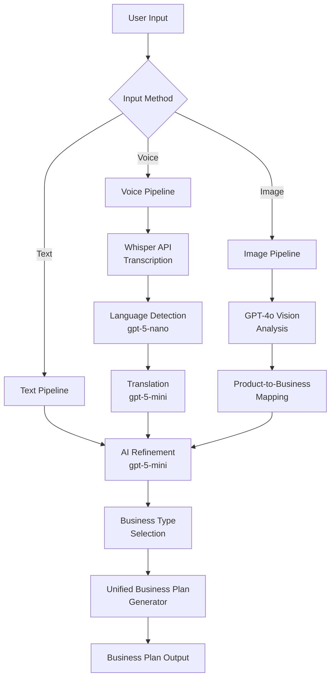
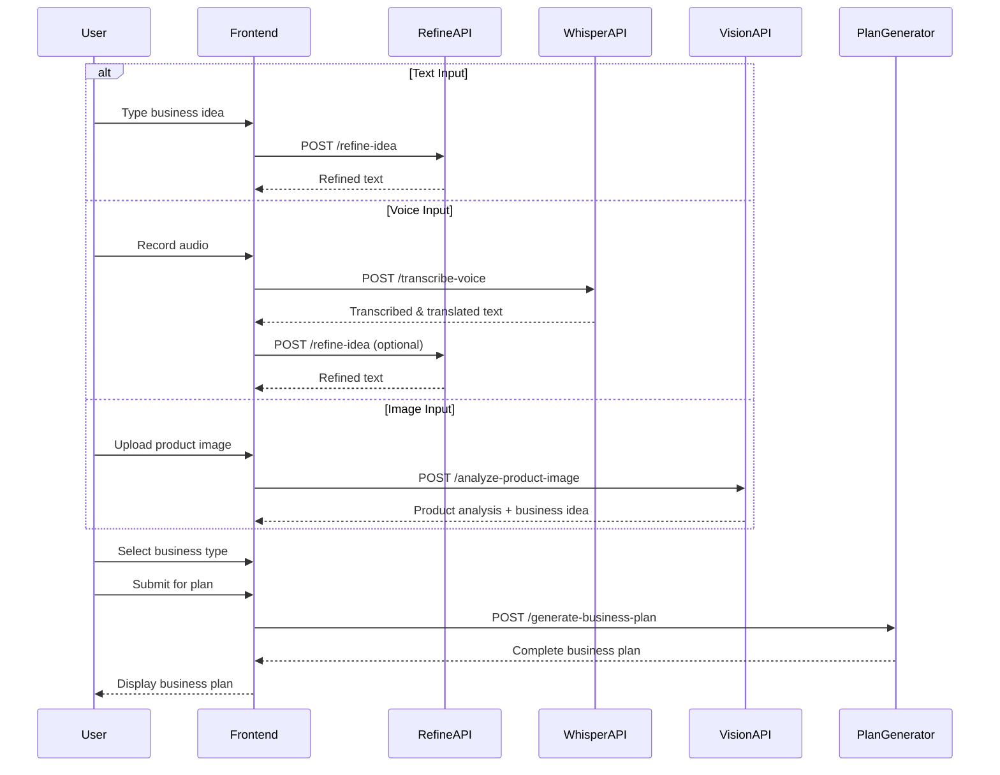
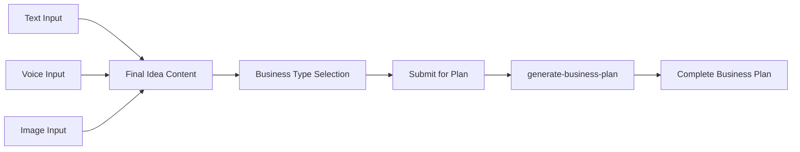

# CraftBiz - Input Pipeline Specification

**Version**: 3.0  
**Last Updated**: January 2025  
**Status**: Production Ready

---

## Table of Contents
1. [Overview](#1-overview)
2. [Architecture & Data Flow](#2-architecture--data-flow)
3. [Text Input Pipeline](#3-text-input-pipeline)
4. [Voice Recording Pipeline](#4-voice-recording-pipeline)
5. [Image Upload Pipeline](#5-image-upload-pipeline)
6. [Unified Business Plan Generation](#6-unified-business-plan-generation)
7. [Input Validation & Security](#7-input-validation--security)
8. [Error Handling & Recovery](#8-error-handling--recovery)
9. [Performance Optimization](#9-performance-optimization)

---

## 1. Overview

### 1.1 Purpose
The Input Pipeline system provides three distinct methods for capturing entrepreneurial business ideas:
- **Text Input**: Natural language description with AI refinement
- **Voice Recording**: Multilingual speech-to-text with auto-translation
- **Image Upload**: Product analysis using AI Vision

All input methods converge into a unified business plan generation pipeline.

### 1.2 Key Features
- **Multi-modal Input**: Support for text, voice, and image
- **AI Enhancement**: Optional refinement for all input types
- **Language Agnostic**: Auto-detect and translate any language
- **Product Intelligence**: Extract business context from product images
- **Real-time Validation**: Immediate feedback on input quality

---

## 2. Architecture & Data Flow

### 2.1 System Architecture



### 2.2 Data Flow Sequence



### 2.3 Component Interaction

| Component | Responsibility | Technology |
|-----------|----------------|------------|
| **IdeaCapture.tsx** | Input UI, method selection | React, TypeScript |
| **ImageUpload.tsx** | Image handling, validation | React, FileReader API |
| **refine-idea** | Text enhancement | Edge Function, GPT-5 Mini |
| **transcribe-voice** | Speech-to-text | Edge Function, Whisper |
| **analyze-product-image** | Image analysis | Edge Function, GPT-4o |
| **generate-business-plan** | Plan creation | Edge Function, GPT-5 |

---

## 3. Text Input Pipeline

### 3.1 Overview

**Purpose**: Capture business ideas in natural language with optional AI refinement

**Flow**:
1. User types business idea (10-5000 characters)
2. Real-time character count validation
3. Optional: Click AI refinement icon (✨)
4. AI polishes text into professional description
5. Select business type from dropdown
6. Submit for business plan generation

### 3.2 API Endpoint

**Endpoint**: `POST /functions/v1/refine-idea`  
**AI Model**: `gpt-5-mini-2025-08-07`

### 3.3 Request Schema

```json
{
  "rawIdea": "string (10-5000 chars)"
}
```

**Example**:
```json
{
  "rawIdea": "pottery"
}
```

### 3.4 Response Schema

```json
{
  "success": true,
  "data": {
    "refinedIdea": "string (refined business description)"
  }
}
```

**Example**:
```json
{
  "success": true,
  "data": {
    "refinedIdea": "An artisan-led business specializing in handcrafted pottery, ceramic décor, and functional homeware. The venture combines traditional craftsmanship with modern aesthetics to produce unique, sustainable, and customizable products for homes, cafés, and gifting markets."
  }
}
```

### 3.5 AI Prompt Template

```markdown
**Role**: You are an expert business consultant specializing in refining entrepreneurial ideas into clear, actionable business concepts.

**Context**:
- User Input: {{rawIdea}}
- Target Audience: Indian entrepreneurs and artisans
- Output Purpose: Input for business plan generation

**Instruction**: 
Transform the raw business idea into a professional, descriptive business concept that:
1. Clearly defines what the business does
2. Identifies target customers
3. Highlights unique value proposition
4. Mentions relevant products/services
5. Maintains authenticity and cultural context

Keep the output to 150-200 words. Do NOT create structured sections - provide a cohesive paragraph.

**Output Format**: Single descriptive paragraph (NOT bullet points or sections)
```

### 3.6 Edge Function Implementation

```typescript
// supabase/functions/refine-idea/index.ts
import "https://deno.land/x/xhr@0.1.0/mod.ts";
import { serve } from "https://deno.land/std@0.168.0/http/server.ts";

const corsHeaders = {
  'Access-Control-Allow-Origin': '*',
  'Access-Control-Allow-Headers': 'authorization, x-client-info, apikey, content-type',
};

serve(async (req) => {
  if (req.method === 'OPTIONS') {
    return new Response(null, { headers: corsHeaders });
  }

  try {
    const { rawIdea } = await req.json();
    const OPENAI_API_KEY = Deno.env.get('OPENAI_API_KEY');

    if (!rawIdea || rawIdea.trim().length < 10) {
      throw new Error('Business idea must be at least 10 characters');
    }

    const systemPrompt = `You are an expert business consultant specializing in refining entrepreneurial ideas into clear, actionable business concepts for Indian entrepreneurs and artisans.`;

    const userPrompt = `Transform this raw business idea into a professional, descriptive business concept (150-200 words):

"${rawIdea}"

Requirements:
- Clearly define what the business does
- Identify target customers
- Highlight unique value proposition
- Mention relevant products/services
- Maintain cultural context for Indian market

Provide a single cohesive paragraph (NOT bullet points or sections).`;

    const response = await fetch("https://api.openai.com/v1/chat/completions", {
      method: "POST",
      headers: {
        "Authorization": `Bearer ${OPENAI_API_KEY}`,
        "Content-Type": "application/json"
      },
      body: JSON.stringify({
        model: "gpt-5-mini-2025-08-07",
        messages: [
          { role: "system", content: systemPrompt },
          { role: "user", content: userPrompt }
        ],
        max_completion_tokens: 300
      })
    });

    if (!response.ok) {
      const errorText = await response.text();
      console.error('OpenAI API error:', response.status, errorText);
      throw new Error(`AI refinement failed: ${response.status}`);
    }

    const data = await response.json();
    const refinedIdea = data.choices[0].message.content.trim();

    return new Response(
      JSON.stringify({ 
        success: true, 
        data: { refinedIdea }
      }),
      { headers: { ...corsHeaders, 'Content-Type': 'application/json' }}
    );

  } catch (error) {
    console.error('Error refining idea:', error);
    return new Response(
      JSON.stringify({ 
        success: false, 
        error: {
          code: 'REFINEMENT_FAILED',
          message: error instanceof Error ? error.message : 'Unknown error'
        }
      }),
      { status: 500, headers: { ...corsHeaders, 'Content-Type': 'application/json' }}
    );
  }
});
```

### 3.7 Frontend Implementation

```typescript
// src/components/idea/IdeaCapture.tsx
const [businessIdea, setBusinessIdea] = useState('');
const [isRefining, setIsRefining] = useState(false);

const handleRefineIdea = async () => {
  if (!businessIdea.trim() || businessIdea.length < 10) {
    toast.error("Please enter at least 10 characters");
    return;
  }

  setIsRefining(true);
  
  try {
    const { data, error } = await supabase.functions.invoke('refine-idea', {
      body: { rawIdea: businessIdea }
    });

    if (error) throw error;

    if (data?.success) {
      setBusinessIdea(data.data.refinedIdea);
      toast.success("Idea refined successfully!");
    }
  } catch (error) {
    console.error('Refinement error:', error);
    toast.error("Failed to refine idea. Please try again.");
  } finally {
    setIsRefining(false);
  }
};
```

### 3.8 Validation Rules

| Field | Rule | Error Message |
|-------|------|---------------|
| Business Idea | Min 10 chars | "Idea must be at least 10 characters" |
| Business Idea | Max 5000 chars | "Idea must be less than 5000 characters" |
| Business Idea | Not empty/whitespace | "Business idea is required" |
| Business Type | Must be selected | "Please select a business type" |

---

## 4. Voice Recording Pipeline

### 4.1 Overview

**Purpose**: Capture business ideas via voice in any language with automatic transcription and translation

**Flow**:
1. User clicks "Start Recording" button
2. Browser requests microphone permission
3. User speaks in any language (max 5 minutes)
4. User clicks "Stop Recording"
5. Audio sent to Whisper API for transcription
6. Language auto-detected (GPT-5 Nano)
7. If not English, translate to English (GPT-5 Mini)
8. Display transcribed text
9. Optional: Click AI refinement icon (✨)
10. Submit for business plan generation

### 4.2 API Endpoint

**Endpoint**: `POST /functions/v1/transcribe-voice`  
**AI Models**: 
- **Whisper-1**: Audio transcription
- **GPT-5 Nano**: Language detection
- **GPT-5 Mini**: Translation (if needed)

### 4.3 Request Schema

```json
{
  "audioBase64": "string (base64 encoded audio)"
}
```

**Example**:
```json
{
  "audioBase64": "data:audio/webm;base64,GkXfo59ChoEBQveBAULygQRC84EIQoKEd2VibUKHgQRChYECGFOAZwH/////////FUmpZpkq17GDD0JATYCGQ2hyb21lV0GGQ2hyb21lFlSua7+uvdeBAXPFhwFHy..."
}
```

### 4.4 Response Schema

```json
{
  "success": true,
  "data": {
    "transcribedText": "string (original transcription)",
    "detectedLanguage": "string (ISO 639-1 code)",
    "englishTranslation": "string (English version)"
  }
}
```

**Example**:
```json
{
  "success": true,
  "data": {
    "transcribedText": "मैं स्थानीय कारीगरों के लिए हस्तनिर्मित शिल्प का एक ऑनलाइन बाज़ार शुरू करना चाहता हूँ",
    "detectedLanguage": "hi",
    "englishTranslation": "I want to start an online marketplace for handmade crafts by local artisans"
  }
}
```

### 4.5 AI Prompt Templates

**Language Detection Prompt**:
```markdown
**Role**: You are a language detection expert.

**Context**: 
- Input Text: {{transcribedText}}

**Instruction**: 
Identify the language of this text and return ONLY the ISO 639-1 language code (e.g., "en", "hi", "ta", "bn").

**Output Format**: Two-letter language code only
```

**Translation Prompt**:
```markdown
**Role**: You are a professional translator specializing in business content.

**Context**:
- Source Language: {{detectedLanguage}}
- Source Text: {{transcribedText}}
- Target Language: English

**Instruction**: 
Translate the business idea to English while:
1. Preserving the original meaning and intent
2. Maintaining business terminology accuracy
3. Keeping cultural context intact
4. Using natural English phrasing

**Output Format**: Plain English translation (no explanations)
```

### 4.6 Edge Function Implementation

```typescript
// supabase/functions/transcribe-voice/index.ts
import "https://deno.land/x/xhr@0.1.0/mod.ts";
import { serve } from "https://deno.land/std@0.168.0/http/server.ts";

const corsHeaders = {
  'Access-Control-Allow-Origin': '*',
  'Access-Control-Allow-Headers': 'authorization, x-client-info, apikey, content-type',
};

// Process base64 in chunks to prevent memory issues
function processBase64Chunks(base64String: string, chunkSize = 32768) {
  const chunks: Uint8Array[] = [];
  let position = 0;
  
  // Remove data URL prefix if present
  const base64Data = base64String.includes(',') 
    ? base64String.split(',')[1] 
    : base64String;
  
  while (position < base64Data.length) {
    const chunk = base64Data.slice(position, position + chunkSize);
    const binaryChunk = atob(chunk);
    const bytes = new Uint8Array(binaryChunk.length);
    
    for (let i = 0; i < binaryChunk.length; i++) {
      bytes[i] = binaryChunk.charCodeAt(i);
    }
    
    chunks.push(bytes);
    position += chunkSize;
  }

  const totalLength = chunks.reduce((acc, chunk) => acc + chunk.length, 0);
  const result = new Uint8Array(totalLength);
  let offset = 0;

  for (const chunk of chunks) {
    result.set(chunk, offset);
    offset += chunk.length;
  }

  return result;
}

serve(async (req) => {
  if (req.method === 'OPTIONS') {
    return new Response(null, { headers: corsHeaders });
  }

  try {
    const { audioBase64 } = await req.json();
    const OPENAI_API_KEY = Deno.env.get('OPENAI_API_KEY');

    if (!audioBase64) {
      throw new Error('No audio data provided');
    }

    // Step 1: Transcribe audio with Whisper
    const binaryAudio = processBase64Chunks(audioBase64);
    
    const formData = new FormData();
    const blob = new Blob([binaryAudio], { type: 'audio/webm' });
    formData.append('file', blob, 'audio.webm');
    formData.append('model', 'whisper-1');

    const transcriptionResponse = await fetch('https://api.openai.com/v1/audio/transcriptions', {
      method: 'POST',
      headers: {
        'Authorization': `Bearer ${OPENAI_API_KEY}`,
      },
      body: formData,
    });

    if (!transcriptionResponse.ok) {
      throw new Error(`Whisper API error: ${await transcriptionResponse.text()}`);
    }

    const { text: transcribedText } = await transcriptionResponse.json();

    // Step 2: Detect language with GPT-5 Nano
    const languageDetectionResponse = await fetch("https://api.openai.com/v1/chat/completions", {
      method: "POST",
      headers: {
        "Authorization": `Bearer ${OPENAI_API_KEY}`,
        "Content-Type": "application/json"
      },
      body: JSON.stringify({
        model: "gpt-5-nano-2025-08-07",
        messages: [
          { 
            role: "system", 
            content: "You are a language detection expert. Return ONLY the ISO 639-1 language code." 
          },
          { 
            role: "user", 
            content: `Identify the language of this text: "${transcribedText}"` 
          }
        ],
        max_completion_tokens: 10
      })
    });

    if (!languageDetectionResponse.ok) {
      throw new Error('Language detection failed');
    }

    const languageData = await languageDetectionResponse.json();
    const detectedLanguage = languageData.choices[0].message.content.trim().toLowerCase();

    let englishTranslation = transcribedText;

    // Step 3: Translate if not English
    if (detectedLanguage !== 'en') {
      const translationResponse = await fetch("https://api.openai.com/v1/chat/completions", {
        method: "POST",
        headers: {
          "Authorization": `Bearer ${OPENAI_API_KEY}`,
          "Content-Type": "application/json"
        },
        body: JSON.stringify({
          model: "gpt-5-mini-2025-08-07",
          messages: [
            { 
              role: "system", 
              content: "You are a professional translator. Translate business ideas accurately to English." 
            },
            { 
              role: "user", 
              content: `Translate this business idea to English: "${transcribedText}"` 
            }
          ],
          max_completion_tokens: 200
        })
      });

      if (!translationResponse.ok) {
        throw new Error('Translation failed');
      }

      const translationData = await translationResponse.json();
      englishTranslation = translationData.choices[0].message.content.trim();
    }

    return new Response(
      JSON.stringify({ 
        success: true, 
        data: {
          transcribedText,
          detectedLanguage,
          englishTranslation
        }
      }),
      { headers: { ...corsHeaders, 'Content-Type': 'application/json' }}
    );

  } catch (error) {
    console.error('Error transcribing voice:', error);
    return new Response(
      JSON.stringify({ 
        success: false, 
        error: {
          code: 'TRANSCRIPTION_FAILED',
          message: error instanceof Error ? error.message : 'Unknown error'
        }
      }),
      { status: 500, headers: { ...corsHeaders, 'Content-Type': 'application/json' }}
    );
  }
});
```

### 4.7 Frontend Implementation

```typescript
// src/components/idea/IdeaCapture.tsx
const [isRecording, setIsRecording] = useState(false);
const [mediaRecorder, setMediaRecorder] = useState<MediaRecorder | null>(null);
const [transcribedText, setTranscribedText] = useState('');

const handleVoiceRecording = async () => {
  if (!isRecording) {
    try {
      // Start recording
      const stream = await navigator.mediaDevices.getUserMedia({ audio: true });
      const recorder = new MediaRecorder(stream);
      const chunks: BlobPart[] = [];
      
      recorder.ondataavailable = (e) => chunks.push(e.data);
      
      recorder.onstop = async () => {
        const blob = new Blob(chunks, { type: 'audio/webm' });
        const reader = new FileReader();
        
        reader.onloadend = async () => {
          const audioBase64 = reader.result as string;
          
          try {
            const { data, error } = await supabase.functions.invoke('transcribe-voice', {
              body: { audioBase64 }
            });
            
            if (error) throw error;
            
            if (data?.success) {
              setTranscribedText(data.data.englishTranslation);
              toast.success(`Detected ${data.data.detectedLanguage.toUpperCase()}, transcribed and translated`);
            }
          } catch (error) {
            console.error('Transcription error:', error);
            toast.error("Failed to transcribe audio");
          }
        };
        
        reader.readAsDataURL(blob);
        
        // Stop all tracks
        stream.getTracks().forEach(track => track.stop());
      };
      
      recorder.start();
      setMediaRecorder(recorder);
      setIsRecording(true);
      toast.success("Recording started");
      
    } catch (error) {
      console.error('Microphone error:', error);
      toast.error("Microphone access denied");
    }
  } else {
    // Stop recording
    if (mediaRecorder) {
      mediaRecorder.stop();
      setIsRecording(false);
      toast.info("Processing audio...");
    }
  }
};
```

### 4.8 Supported Languages

**Indian Languages**:
- Hindi (hi)
- Tamil (ta)
- Telugu (te)
- Bengali (bn)
- Marathi (mr)
- Gujarati (gu)
- Kannada (kn)
- Malayalam (ml)
- Punjabi (pa)
- Odia (or)

**International Languages**:
- English (en)
- Spanish (es)
- French (fr)
- German (de)
- Chinese (zh)
- Japanese (ja)
- And 100+ more languages

### 4.9 Validation Rules

| Field | Rule | Error Message |
|-------|------|---------------|
| Audio File | Max 5 minutes | "Recording must be less than 5 minutes" |
| Audio File | Max 25MB | "Audio file too large" |
| Audio Format | WebM, MP3, M4A | "Unsupported audio format" |
| Microphone | Permission required | "Microphone access required" |

---

## 5. Image Upload Pipeline

### 5.1 Overview

**Purpose**: Analyze product images to extract business context and generate business ideas

**Flow**:
1. User clicks "Upload Image" button
2. File picker opens (JPG, PNG, WEBP)
3. User selects product image
4. Image validated (type, size, dimensions)
5. Image sent to GPT-4o Vision for analysis
6. AI identifies product type, materials, style
7. AI maps product to business concept
8. Display analysis with suggested business idea
9. User can refine or proceed to business plan

### 5.2 API Endpoint

**Endpoint**: `POST /functions/v1/analyze-product-image`  
**AI Model**: `gpt-4o` (Vision)

### 5.3 Request Schema

```json
{
  "imageBase64": "string (base64 encoded image)",
  "source": "string (upload | camera)"
}
```

**Example**:
```json
{
  "imageBase64": "data:image/jpeg;base64,/9j/4AAQSkZJRgABAQAAAQABAAD/2wBDAAYEBQYFBAYGBQYHBwYIChAKCgkJChQODwwQFxQYGBcUFhYaHSUfGhsjHBYWICwgIyYnKSopGR8tMC0oMCUoKSj/2wBDAQcHBwoIChMKChMoGhYaKCgoKCgoKCgoKCgoKCgoKCgoKCgoKCgoKCgoKCgoKCgoKCgoKCgoKCgoKCgoKCgoKCj/...",
  "source": "upload"
}
```

### 5.4 Response Schema

```json
{
  "success": true,
  "data": {
    "analysis": {
      "productType": "string",
      "materials": ["string"],
      "style": "string",
      "colors": ["string"],
      "targetAudience": "string",
      "businessContext": "string",
      "suggestedBusinessIdea": "string"
    }
  }
}
```

**Example**:
```json
{
  "success": true,
  "data": {
    "analysis": {
      "productType": "Handwoven Textile / Fabric",
      "materials": ["Natural Cotton", "Traditional Dyes", "Hand-spun Thread"],
      "style": "Traditional Indian Handloom",
      "colors": ["Natural Beige", "Indigo Blue", "Earth Tones"],
      "targetAudience": "Urban eco-conscious customers aged 25-45 who value sustainable living",
      "businessContext": "Sustainable Fashion / Ethnic Wear",
      "suggestedBusinessIdea": "A business selling eco-friendly handcrafted traditional textiles, targeting urban customers who value sustainable living and authentic craftsmanship. The venture would connect local weavers with conscious consumers, offering customizable handloom fabrics for clothing, home décor, and gifting. Revenue streams include direct sales, custom orders, and wholesale to boutiques."
    }
  }
}
```

### 5.5 AI Prompt Template

```markdown
**Role**: You are an expert product analyst and business consultant specializing in artisan products and handicrafts in the Indian market.

**Context**:
- Input: Product image uploaded by entrepreneur
- Target Market: Indian consumers and global ethnic product enthusiasts
- Business Focus: Artisan crafts, sustainable products, traditional techniques

**Instruction**: 
Analyze this product image and extract the following information:

1. **Product Type**: What is this product? (e.g., pottery, textile, jewelry)
2. **Materials**: What materials are used? Identify traditional/artisan techniques
3. **Style**: What design style? (traditional, contemporary, fusion)
4. **Colors**: Dominant color palette
5. **Target Audience**: Who would buy this product? Demographics and psychographics
6. **Business Context**: What business category does this fit? (e.g., sustainable fashion, home décor)
7. **Suggested Business Idea**: Generate a complete business concept (150-200 words) based on this product

Focus on:
- Authenticity and craftsmanship
- Market viability in India
- Sustainable and ethical aspects
- Cultural significance
- Revenue potential

**Output Format**: Structured JSON with all fields filled
```

### 5.6 Edge Function Implementation

```typescript
// supabase/functions/analyze-product-image/index.ts
import "https://deno.land/x/xhr@0.1.0/mod.ts";
import { serve } from "https://deno.land/std@0.168.0/http/server.ts";

const corsHeaders = {
  'Access-Control-Allow-Origin': '*',
  'Access-Control-Allow-Headers': 'authorization, x-client-info, apikey, content-type',
};

serve(async (req) => {
  if (req.method === 'OPTIONS') {
    return new Response(null, { headers: corsHeaders });
  }

  try {
    const { imageBase64, source } = await req.json();
    const OPENAI_API_KEY = Deno.env.get('OPENAI_API_KEY');

    if (!imageBase64) {
      throw new Error('No image provided');
    }

    const systemPrompt = `You are an expert product analyst and business consultant specializing in artisan products and handicrafts in the Indian market. Analyze product images and extract business insights.`;

    const userPrompt = `Analyze this product image and provide detailed insights for a business concept.

Extract:
1. Product Type (what is this?)
2. Materials (identify traditional/artisan techniques)
3. Style (traditional, contemporary, fusion)
4. Colors (dominant palette)
5. Target Audience (demographics & psychographics)
6. Business Context (category/niche)
7. Suggested Business Idea (150-200 words complete business concept)

Focus on authenticity, craftsmanship, market viability, sustainability, and cultural significance for Indian market.`;

    const response = await fetch("https://api.openai.com/v1/chat/completions", {
      method: "POST",
      headers: {
        "Authorization": `Bearer ${OPENAI_API_KEY}`,
        "Content-Type": "application/json"
      },
      body: JSON.stringify({
        model: "gpt-4o",
        messages: [
          { role: "system", content: systemPrompt },
          { 
            role: "user", 
            content: [
              { type: "text", text: userPrompt },
              { 
                type: "image_url", 
                image_url: { 
                  url: imageBase64,
                  detail: "high"
                } 
              }
            ]
          }
        ],
        max_completion_tokens: 800,
        tools: [
          {
            type: "function",
            function: {
              name: "analyze_product",
              description: "Analyze product image for business insights",
              parameters: {
                type: "object",
                properties: {
                  productType: { 
                    type: "string",
                    description: "Type of product shown in image"
                  },
                  materials: { 
                    type: "array",
                    items: { type: "string" },
                    description: "Materials used in the product"
                  },
                  style: { 
                    type: "string",
                    description: "Design style (traditional, contemporary, fusion)"
                  },
                  colors: { 
                    type: "array",
                    items: { type: "string" },
                    description: "Dominant colors in the product"
                  },
                  targetAudience: { 
                    type: "string",
                    description: "Target customer demographics and psychographics"
                  },
                  businessContext: { 
                    type: "string",
                    description: "Business category or niche"
                  },
                  suggestedBusinessIdea: { 
                    type: "string",
                    description: "Complete business concept (150-200 words)"
                  }
                },
                required: [
                  "productType", 
                  "materials", 
                  "style", 
                  "colors", 
                  "targetAudience", 
                  "businessContext", 
                  "suggestedBusinessIdea"
                ],
                additionalProperties: false
              }
            }
          }
        ],
        tool_choice: {
          type: "function",
          function: { name: "analyze_product" }
        }
      })
    });

    if (!response.ok) {
      const errorText = await response.text();
      console.error('GPT-4o Vision error:', response.status, errorText);
      throw new Error(`Image analysis failed: ${response.status}`);
    }

    const data = await response.json();
    const toolCall = data.choices[0].message.tool_calls[0];
    const analysis = JSON.parse(toolCall.function.arguments);

    return new Response(
      JSON.stringify({ 
        success: true, 
        data: { analysis }
      }),
      { headers: { ...corsHeaders, 'Content-Type': 'application/json' }}
    );

  } catch (error) {
    console.error('Error analyzing product image:', error);
    return new Response(
      JSON.stringify({ 
        success: false, 
        error: {
          code: 'ANALYSIS_FAILED',
          message: error instanceof Error ? error.message : 'Unknown error'
        }
      }),
      { status: 500, headers: { ...corsHeaders, 'Content-Type': 'application/json' }}
    );
  }
});
```

### 5.7 Frontend Implementation

```typescript
// src/components/idea/ImageUpload.tsx
const handleImageUpload = async (event: React.ChangeEvent<HTMLInputElement>) => {
  const file = event.target.files?.[0];
  if (!file) return;

  // Validate file type
  if (!file.type.startsWith('image/')) {
    toast.error("Please upload an image file (JPG, PNG, WEBP)");
    return;
  }

  // Validate file size (max 10MB)
  if (file.size > 10 * 1024 * 1024) {
    toast.error("Image must be less than 10MB");
    return;
  }

  setIsAnalyzing(true);

  const reader = new FileReader();
  reader.onloadend = async () => {
    const imageBase64 = reader.result as string;
    
    try {
      const { data, error } = await supabase.functions.invoke('analyze-product-image', {
        body: { 
          imageBase64, 
          source: 'upload' 
        }
      });
      
      if (error) throw error;
      
      if (data?.success) {
        setProductAnalysis(data.data.analysis);
        toast.success(`Identified as ${data.data.analysis.productType}!`);
      }
    } catch (error) {
      console.error('Analysis error:', error);
      toast.error("Failed to analyze image. Please try again.");
    } finally {
      setIsAnalyzing(false);
    }
  };
  
  reader.readAsDataURL(file);
};
```

### 5.8 Validation Rules

| Field | Rule | Error Message |
|-------|------|---------------|
| Image Format | JPG, PNG, WEBP | "Unsupported image format" |
| Image Size | Max 10MB | "Image must be less than 10MB" |
| Image Dimensions | Min 512x512 | "Image too small (min 512x512)" |
| Image Dimensions | Max 4096x4096 | "Image too large (max 4096x4096)" |
| File Type | Must be image/* | "Please upload an image file" |

---

## 6. Unified Business Plan Generation

### 6.1 Overview

All three input methods (text, voice, image) converge into a single business plan generation endpoint.

**Consolidated Flow**:


### 6.2 Final Submission Handler

**Endpoint**: `POST /functions/v1/generate-business-plan`

**Request Schema**:
```json
{
  "businessIdea": "string (refined idea from any input method)",
  "businessType": "string (selected type)",
  "inputMethod": "text | voice | image",
  "productAnalysis": "object | null (from image analysis)"
}
```

**Frontend Implementation**:
```typescript
const handleSubmit = async () => {
  // Consolidate idea content from any input method
  const ideaContent = productData?.analysis?.suggestedBusinessIdea 
    || transcribedText 
    || businessIdea;
  
  // Validate
  if (!ideaContent?.trim() || !businessType) {
    toast.error("Please provide your business idea and select a type");
    return;
  }

  setIsProcessing(true);
  
  try {
    const { data, error } = await supabase.functions.invoke('generate-business-plan', {
      body: {
        businessIdea: ideaContent,
        businessType,
        inputMethod,
        productAnalysis: productData?.analysis || null
      }
    });
    
    if (error) throw error;
    
    if (data?.success) {
      onIdeaSubmit(data.data);
      toast.success("Business Plan Generated!");
    }
  } catch (error) {
    console.error('Generation error:', error);
    toast.error("Failed to generate business plan");
  } finally {
    setIsProcessing(false);
  }
};
```

### 6.3 Data Consolidation

| Input Method | Primary Data | Additional Data | Business Type |
|--------------|--------------|-----------------|---------------|
| Text | `businessIdea` | None | User selected |
| Voice | `transcribedText` (English) | `detectedLanguage` | User selected |
| Image | `analysis.suggestedBusinessIdea` | Full `productAnalysis` | User selected |

---

## 7. Input Validation & Security

### 7.1 Client-Side Validation

**Zod Schemas**:

```typescript
import { z } from 'zod';

// Text Input Validation
export const textInputSchema = z.object({
  businessIdea: z.string()
    .min(10, "Business idea must be at least 10 characters")
    .max(5000, "Business idea must be less than 5000 characters")
    .trim()
    .refine(val => val.length > 0, "Business idea cannot be empty"),
  businessType: z.enum([
    "E-commerce",
    "Retail",
    "Services",
    "Manufacturing",
    "Food & Beverage",
    "Technology",
    "Healthcare",
    "Education",
    "Other"
  ])
});

// Voice Input Validation
export const voiceInputSchema = z.object({
  audioBase64: z.string()
    .refine(val => val.startsWith('data:audio/'), "Invalid audio format")
    .refine(val => {
      const base64Data = val.split(',')[1];
      const size = (base64Data.length * 3) / 4; // Approximate size in bytes
      return size <= 25 * 1024 * 1024; // 25MB max
    }, "Audio file too large (max 25MB)")
});

// Image Upload Validation
export const imageUploadSchema = z.object({
  file: z.instanceof(File)
    .refine(file => file.type.startsWith('image/'), "File must be an image")
    .refine(
      file => ['image/jpeg', 'image/png', 'image/webp'].includes(file.type),
      "Supported formats: JPG, PNG, WEBP"
    )
    .refine(
      file => file.size <= 10 * 1024 * 1024,
      "Image must be less than 10MB"
    )
});
```

### 7.2 Server-Side Validation

**Edge Function Validation**:

```typescript
// Validate request body
function validateRequest(body: any, schema: any) {
  try {
    return schema.parse(body);
  } catch (error) {
    if (error instanceof z.ZodError) {
      throw new Error(`Validation failed: ${error.errors[0].message}`);
    }
    throw error;
  }
}

// Usage in edge function
const requestSchema = z.object({
  rawIdea: z.string().min(10).max(5000),
});

const validatedData = validateRequest(await req.json(), requestSchema);
```

### 7.3 Security Measures

**Input Sanitization**:
- Trim whitespace
- Remove null bytes
- Escape special characters
- Validate encoding (UTF-8)

**Rate Limiting** (per user):
- Text refinement: 10 requests/minute
- Voice transcription: 5 requests/minute
- Image analysis: 3 requests/minute
- Business plan generation: 2 requests/minute

**API Key Protection**:
- Never expose OpenAI API key in frontend
- Store in Supabase Secrets
- Use HTTPS only
- Validate JWT tokens in edge functions

---

## 8. Error Handling & Recovery

### 8.1 Error Categories

| Category | Examples | User Action | System Action |
|----------|----------|-------------|---------------|
| **Validation** | Empty input, invalid format | Fix input and retry | Show specific error message |
| **Permission** | Microphone denied | Grant permission | Show permission request UI |
| **Network** | Offline, timeout | Check connection | Retry with exponential backoff |
| **AI Service** | OpenAI rate limit | Wait and retry | Queue request, show progress |
| **Storage** | Upload failed | Retry upload | Use fallback storage |

### 8.2 Error Response Format

```json
{
  "success": false,
  "error": {
    "code": "ERROR_CODE",
    "message": "User-friendly error message",
    "details": {
      "field": "businessIdea",
      "issue": "Must be at least 10 characters"
    },
    "retry": true,
    "timestamp": "2025-01-23T10:00:00Z"
  }
}
```

### 8.3 Error Handling Strategies

**Frontend Error Handling**:

```typescript
const handleError = (error: any, context: string) => {
  console.error(`${context} error:`, error);
  
  // Network errors
  if (error.message?.includes('network') || error.message?.includes('fetch')) {
    toast.error("Network error. Please check your connection.");
    return;
  }
  
  // Validation errors
  if (error.message?.includes('validation')) {
    toast.error(error.message);
    return;
  }
  
  // Permission errors
  if (error.message?.includes('permission')) {
    toast.error("Permission required. Please allow access.");
    return;
  }
  
  // Rate limit errors
  if (error.status === 429) {
    toast.error("Too many requests. Please wait a moment.");
    return;
  }
  
  // Generic error
  toast.error(`Failed to ${context}. Please try again.`);
};
```

**Retry Logic**:

```typescript
async function retryWithBackoff<T>(
  fn: () => Promise<T>,
  maxRetries = 3,
  baseDelay = 1000
): Promise<T> {
  let lastError: Error;
  
  for (let i = 0; i < maxRetries; i++) {
    try {
      return await fn();
    } catch (error) {
      lastError = error as Error;
      
      // Don't retry validation errors
      if (error.message?.includes('validation')) {
        throw error;
      }
      
      // Exponential backoff
      if (i < maxRetries - 1) {
        const delay = baseDelay * Math.pow(2, i);
        await new Promise(resolve => setTimeout(resolve, delay));
      }
    }
  }
  
  throw lastError!;
}
```

### 8.4 Fallback Mechanisms

**Offline Support**:
```typescript
// Cache latest successful refinement
localStorage.setItem('last_refined_idea', refinedIdea);

// Use cached version if offline
if (!navigator.onLine) {
  const cached = localStorage.getItem('last_refined_idea');
  if (cached) {
    toast.info("Using cached refinement (offline mode)");
    return cached;
  }
}
```

**Graceful Degradation**:
- If AI refinement fails → Use original input
- If translation fails → Use transcription as-is
- If image analysis fails → Allow manual description

---

## 9. Performance Optimization

### 9.1 Client-Side Optimization

**Debouncing**:
```typescript
import { debounce } from 'lodash';

const debouncedRefine = debounce(async (text: string) => {
  await handleRefineIdea(text);
}, 1000); // Wait 1 second after user stops typing
```

**Image Compression**:
```typescript
async function compressImage(file: File): Promise<string> {
  return new Promise((resolve) => {
    const reader = new FileReader();
    reader.onload = (e) => {
      const img = new Image();
      img.onload = () => {
        const canvas = document.createElement('canvas');
        const ctx = canvas.getContext('2d')!;
        
        // Max dimensions
        const MAX_WIDTH = 1920;
        const MAX_HEIGHT = 1920;
        
        let width = img.width;
        let height = img.height;
        
        if (width > height) {
          if (width > MAX_WIDTH) {
            height = (height * MAX_WIDTH) / width;
            width = MAX_WIDTH;
          }
        } else {
          if (height > MAX_HEIGHT) {
            width = (width * MAX_HEIGHT) / height;
            height = MAX_HEIGHT;
          }
        }
        
        canvas.width = width;
        canvas.height = height;
        ctx.drawImage(img, 0, 0, width, height);
        
        resolve(canvas.toDataURL('image/jpeg', 0.8));
      };
      img.src = e.target?.result as string;
    };
    reader.readAsDataURL(file);
  });
}
```

### 9.2 Server-Side Optimization

**Token Optimization**:
- Use GPT-5 Nano for simple tasks (language detection)
- Use GPT-5 Mini as default for balanced performance
- Reserve GPT-5 for complex business plans only

**Caching Strategy**:
```typescript
// Cache AI responses for identical inputs
const cache = new Map<string, any>();

function getCacheKey(input: string, method: string): string {
  return `${method}:${input.trim().toLowerCase()}`;
}

// Check cache before API call
const cacheKey = getCacheKey(rawIdea, 'refine');
if (cache.has(cacheKey)) {
  return cache.get(cacheKey);
}

// Store in cache after successful response
cache.set(cacheKey, refinedIdea);
```

**Chunked Processing**:
- Process large audio files in chunks
- Stream responses for long-form content
- Use async/await for parallel operations

### 9.3 Performance Metrics

**Target Performance**:

| Operation | Target Time | Acceptable Range |
|-----------|-------------|------------------|
| Text refinement | 2-3s | 1-5s |
| Voice transcription | 3-5s | 2-8s |
| Image analysis | 4-6s | 3-10s |
| Business plan generation | 8-10s | 5-15s |

**Monitoring**:
```typescript
// Track operation duration
const startTime = Date.now();

try {
  const result = await performOperation();
  const duration = Date.now() - startTime;
  
  console.log(JSON.stringify({
    operation: 'refine-idea',
    duration,
    success: true,
    timestamp: new Date().toISOString()
  }));
  
  return result;
} catch (error) {
  const duration = Date.now() - startTime;
  
  console.error(JSON.stringify({
    operation: 'refine-idea',
    duration,
    success: false,
    error: error.message,
    timestamp: new Date().toISOString()
  }));
  
  throw error;
}
```

---

## 10. Testing Guidelines

### 10.1 Unit Tests

**Text Input Tests**:
- ✅ Accepts valid input (10-5000 chars)
- ✅ Rejects empty input
- ✅ Rejects input < 10 chars
- ✅ Rejects input > 5000 chars
- ✅ Trims whitespace correctly
- ✅ Handles special characters

**Voice Input Tests**:
- ✅ Handles microphone permission grant
- ✅ Handles microphone permission denial
- ✅ Processes WebM audio correctly
- ✅ Rejects files > 25MB
- ✅ Rejects non-audio files
- ✅ Handles recording timeout (5 min)

**Image Upload Tests**:
- ✅ Accepts JPG, PNG, WEBP
- ✅ Rejects other formats
- ✅ Validates file size (max 10MB)
- ✅ Validates dimensions (512-4096)
- ✅ Handles corrupted images gracefully

### 10.2 Integration Tests

**End-to-End Flows**:
- ✅ Text → Refinement → Business Plan
- ✅ Voice → Transcription → Translation → Business Plan
- ✅ Image → Analysis → Business Plan
- ✅ All three methods produce valid business plans
- ✅ Error recovery works for all paths

### 10.3 Performance Tests

**Load Testing**:
- 100 concurrent text refinements
- 50 concurrent voice transcriptions
- 25 concurrent image analyses
- Response times under load
- Error rates under stress

---

## 11. Browser Compatibility

### 11.1 Supported Browsers

| Browser | Min Version | Features |
|---------|-------------|----------|
| Chrome | 90+ | Full support |
| Firefox | 88+ | Full support |
| Safari | 14+ | Full support |
| Edge | 90+ | Full support |
| Mobile Safari | iOS 14+ | Full support |
| Chrome Mobile | Android 10+ | Full support |

### 11.2 Feature Support

**MediaRecorder API** (Voice):
- ✅ Chrome 47+
- ✅ Firefox 25+
- ✅ Safari 14+
- ✅ Edge 79+

**FileReader API** (Image Upload):
- ✅ All modern browsers
- ✅ Mobile browsers (iOS 6+, Android 3+)

**Geolocation API** (Optional):
- ✅ All modern browsers with HTTPS

---

**End of Input Pipeline Specification**