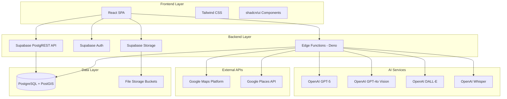
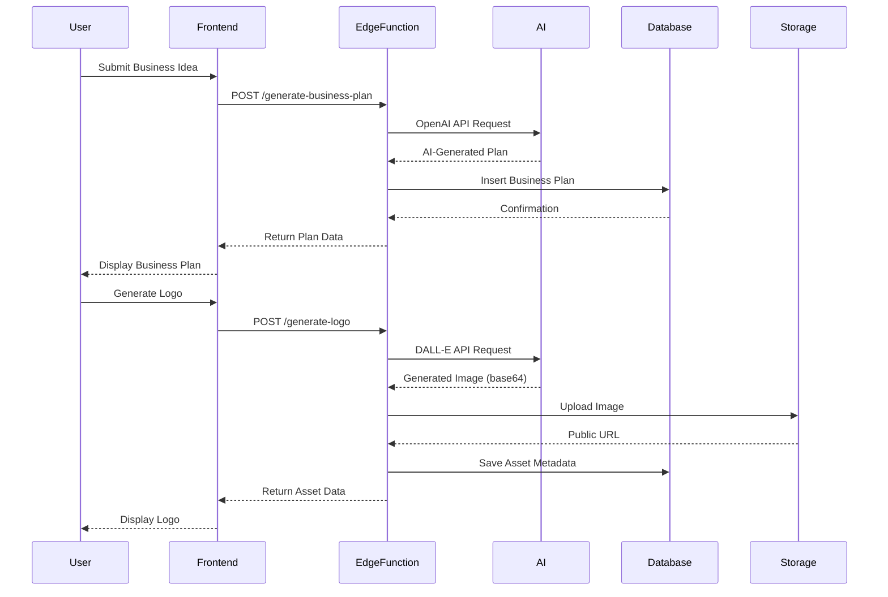
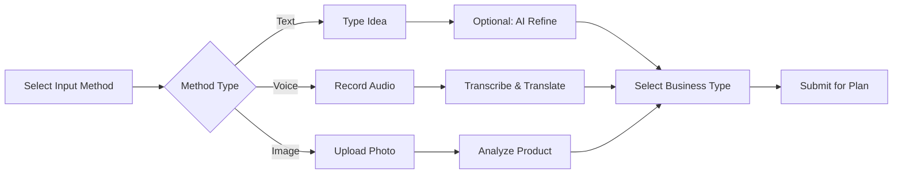
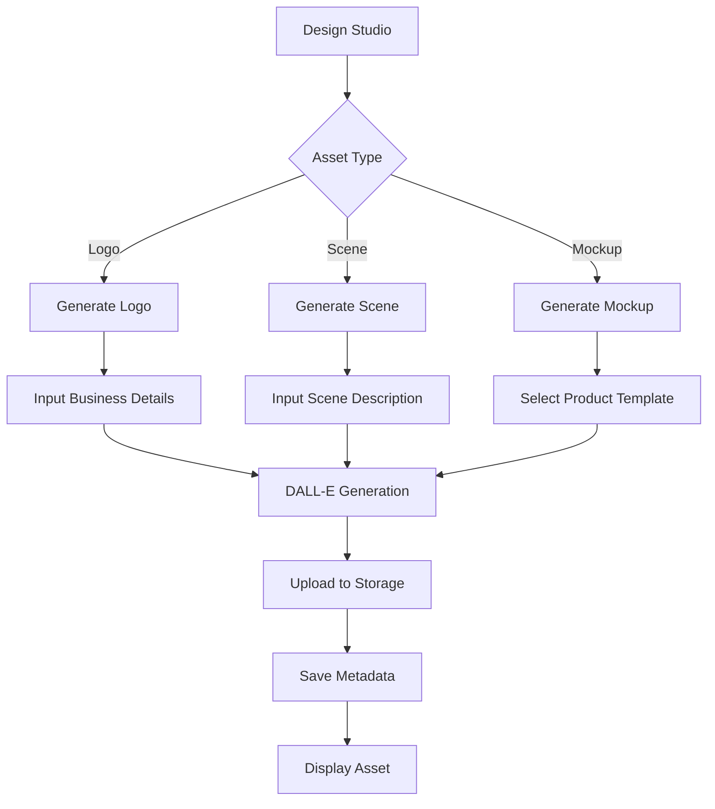
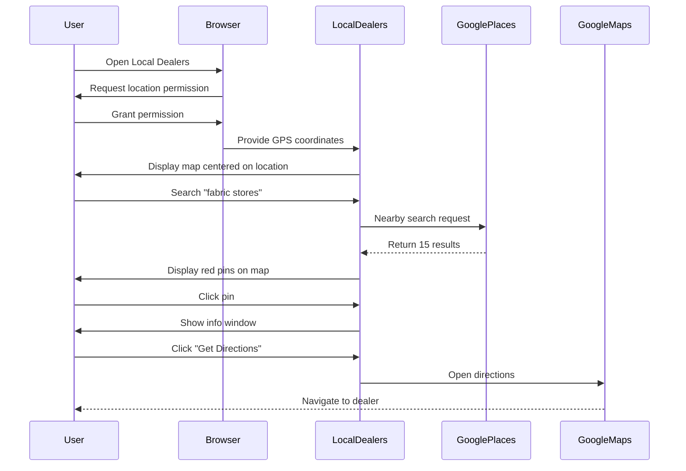
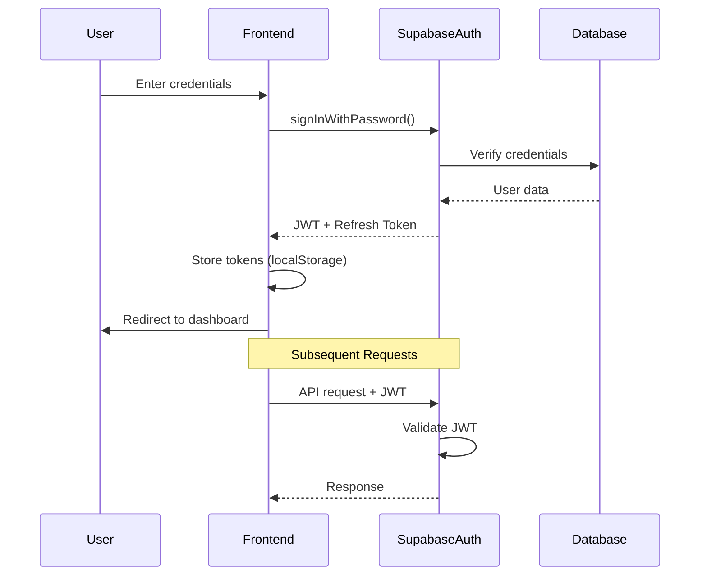

# CraftBiz - Technical Specification

**Version**: 3.0  
**Last Updated**: January 2025  
**Status**: Production Ready

---

## Table of Contents
1. [Executive Summary](#1-executive-summary)
2. [System Architecture](#2-system-architecture)
3. [Technology Stack](#3-technology-stack)
4. [Core Features & Modules](#4-core-features--modules)
5. [Database Schema](#5-database-schema)
6. [Edge Functions](#6-edge-functions)
7. [AI Integration](#7-ai-integration)
8. [External Services](#8-external-services)
9. [Security & Authentication](#9-security--authentication)
10. [Performance & Optimization](#10-performance--optimization)
11. [Deployment](#11-deployment)
12. [Monitoring & Logging](#12-monitoring--logging)

---

## 1. Executive Summary

### 1.1 Project Overview

**CraftBiz** is an AI-powered platform designed for Indian entrepreneurs and artisans to transform business ideas into launch-ready business kits. The platform provides:

- **Multi-modal Input**: Text, voice, and image-based idea capture
- **AI Business Planning**: Comprehensive business plan generation
- **Design Studio**: Logo and visual asset creation
- **Marketing Hub**: Social media content generation
- **Supplier Discovery**: Location-based supplier mapping

### 1.2 Target Users

- Indian artisans and craftspeople
- Small business entrepreneurs
- E-commerce startups
- Handicraft marketplaces
- Sustainable fashion brands

### 1.3 Key Metrics

- **Target Launch**: Q1 2025
- **Expected Users**: 10,000+ in first year
- **Supported Languages**: 20+ Indian languages
- **AI Models**: 6 specialized models
- **Geographic Coverage**: Pan-India

---

## 2. System Architecture

### 2.1 High-Level Architecture



### 2.2 Data Flow Architecture



### 2.3 Component Architecture

**Frontend Components**:
```
src/
├── components/
│   ├── layout/
│   │   └── Navigation.tsx          // Main navigation
│   ├── dashboard/
│   │   └── Dashboard.tsx           // Dashboard view
│   ├── idea/
│   │   ├── IdeaCapture.tsx         // Idea input component
│   │   └── ImageUpload.tsx         // Image upload handler
│   ├── business/
│   │   └── BusinessPlan.tsx        // Business plan display
│   ├── design/
│   │   └── DesignStudio.tsx        // Design tools
│   ├── marketing/
│   │   └── MarketingHub.tsx        // Marketing content
│   ├── suppliers/
│   │   ├── SuppliersMap.tsx        // Main suppliers view
│   │   ├── SuppliersList.tsx       // Suppliers directory
│   │   └── LocalDealersMap.tsx     // Location-based search
│   └── ui/                         // shadcn components
├── pages/
│   ├── Landing.tsx                 // Landing page
│   ├── Auth.tsx                    // Authentication
│   ├── Index.tsx                   // Main app page
│   └── NotFound.tsx                // 404 page
├── hooks/
│   ├── use-mobile.tsx             // Mobile detection
│   └── use-toast.ts               // Toast notifications
└── lib/
    └── utils.ts                    // Utility functions
```

**Backend Functions**:
```
supabase/functions/
├── generate-business-plan/
│   └── index.ts
├── refine-idea/
│   └── index.ts
├── transcribe-voice/
│   └── index.ts
├── analyze-product-image/
│   └── index.ts
├── generate-logo/
│   └── index.ts
├── generate-scene/
│   └── index.ts
├── generate-mockup/
│   └── index.ts
├── generate-marketing-content/
│   └── index.ts
├── nearby-dealers-search/
│   └── index.ts
├── dealer-details/
│   └── index.ts
└── get-directions/
    └── index.ts
```

---

## 3. Technology Stack

### 3.1 Frontend Stack

| Technology | Version | Purpose |
|------------|---------|---------|
| **React** | 18.3.1 | UI framework |
| **TypeScript** | 5.x | Type safety |
| **Vite** | 5.x | Build tool & dev server |
| **React Router** | 6.30.1 | Client-side routing |
| **Tailwind CSS** | 3.x | Styling framework |
| **shadcn/ui** | Latest | Component library (Radix UI) |
| **Lucide React** | Latest | Icon library |
| **React Hook Form** | 7.61.1 | Form management |
| **Zod** | 3.25.76 | Schema validation |
| **Sonner** | 1.7.4 | Toast notifications |

### 3.2 Backend Stack

| Technology | Version | Purpose |
|------------|---------|---------|
| **Supabase** | Latest | Backend platform |
| **PostgreSQL** | 15+ | Relational database |
| **PostGIS** | 3.x | Geospatial extension |
| **Deno** | Latest | Edge functions runtime |
| **Supabase Auth** | Latest | Authentication system |
| **Supabase Storage** | Latest | File storage |

### 3.3 AI & External Services

| Service | Purpose | Cost Model |
|---------|---------|------------|
| **OpenAI GPT-5** | Business plans, complex reasoning | $30/1M input tokens, $60/1M output tokens |
| **OpenAI GPT-5 Mini** | Marketing content, translations | $0.40/1M input tokens, $1.20/1M output tokens |
| **OpenAI GPT-5 Nano** | Language detection, simple tasks | $0.10/1M input tokens, $0.30/1M output tokens |
| **OpenAI GPT-4o** | Image analysis | $5/1M input tokens, $15/1M output tokens |
| **OpenAI DALL-E** | Image generation | $0.04/image (1024x1024) |
| **OpenAI Whisper** | Voice transcription | $0.006/minute |
| **Google Maps Platform** | Location services | $200 free credit/month |

---

## 4. Core Features & Modules

### 4.1 Idea Capture Module

**Purpose**: Multi-modal business idea input system

**Features**:

1. **Text Input**
   - Natural language input
   - Character count: 10-5000
   - AI refinement with GPT-5 Mini
   - Real-time validation

2. **Voice Recording**
   - Browser MediaRecorder API
   - Supported formats: WebM, MP3, M4A
   - Max duration: 5 minutes
   - Whisper API transcription
   - Auto language detection (GPT-5 Nano)
   - Translation to English (GPT-5 Mini)

3. **Image Upload**
   - Supported formats: JPG, PNG, WEBP
   - Max size: 10MB
   - Dimensions: 512x512 to 4096x4096
   - GPT-4o Vision analysis
   - Product-to-business mapping

**User Flow**:


### 4.2 Business Plan Generator

**Purpose**: AI-powered comprehensive business plan creation

**AI Model**: GPT-5 (gpt-5-2025-08-07)

**Generated Sections**:

| Section | Word Count | Description |
|---------|------------|-------------|
| Executive Summary | 150-200 | Business overview and value proposition |
| Market Analysis | 400-500 | Indian market size, trends, competition |
| Business Model | 300-400 | Revenue streams, pricing, cost structure |
| Marketing Strategy | 300-400 | Customer acquisition, channels, campaigns |
| Operations Planning | 300-400 | Supply chain, logistics, technology |
| Financial Projections | 400-500 | Startup costs, revenue forecasts (12-36 months) |

**Additional Features**:
- Financial calculator (startup costs, revenue, break-even)
- Editable plan sections
- PDF export (planned)
- Plan history and versioning

**Sample Output Structure**:
```json
{
  "executive_summary": "CraftBiz is a digital marketplace...",
  "market_analysis": "The Indian handicrafts market is valued...",
  "business_model": "Commission-based model earning 8-12%...",
  "marketing_strategy": "Multi-channel approach including...",
  "operations_planning": "Three-phase rollout starting with...",
  "financial_projections": "Initial investment: ₹5 lakhs..."
}
```

### 4.3 Design Studio

**Purpose**: AI-powered visual brand asset creation

**Capabilities**:

1. **Logo Generation**
   - AI Model: DALL-E (gpt-image-1)
   - Input: Business name, description, style, colors
   - Output: 1024x1024 HD logo
   - Variations: 4 styles per generation
   - Storage: Supabase Storage

2. **Scene Creator**
   - Marketing backgrounds
   - Lifestyle photography
   - Product staging
   - Aspect ratios: 16:9, 1:1, 9:16, 4:3

3. **Product Mockups**
   - Apply logos to products
   - Supported products: T-shirts, mugs, phone cases, tote bags
   - Realistic rendering
   - Professional lighting

**Design Workflow**:


### 4.4 Marketing Hub

**Purpose**: AI-generated marketing content for multiple platforms

**AI Model**: GPT-5 Mini (gpt-5-mini-2025-08-07)

**Supported Platforms**:

| Platform | Character Limit | Hashtags | Output |
|----------|----------------|----------|--------|
| Facebook | 63,206 | 2-3 | Long-form post |
| Instagram | 2,200 | 5-10 | Caption + hashtags |
| Twitter/X | 280 | 1-2 | Concise tweet |
| LinkedIn | 3,000 | 2-3 | Professional post |

**Content Types**:
- Social media posts
- Ad copy
- Email newsletters
- Blog introductions

**Features**:
- Platform-specific optimization
- Audience targeting (millennials, conscious consumers, etc.)
- Tone selection (inspirational, professional, casual)
- Hashtag research
- Character count tracking
- Copy to clipboard
- Content history

### 4.5 Suppliers Module

**Purpose**: Location-based supplier discovery and connection

**Two Sub-Modules**:

1. **Suppliers Directory**
   - Mock database of suppliers
   - Filter by category, city, material
   - List and map views
   - Supplier profiles
   - Contact information

2. **Local Dealers (New Feature)**
   - Real-time geolocation
   - Google Places API integration
   - Nearby search by category
   - Interactive map display
   - Distance calculation
   - "Get Directions" functionality
   - Dealer details (ratings, reviews, hours)

**Local Dealers Features**:

```typescript
interface LocalDealersFeatures {
  geolocation: {
    method: 'browser GPS',
    permissions: 'user-granted',
    fallback: 'manual city selection'
  },
  search: {
    methods: ['keyword', 'category', 'radius'],
    radius_options: [1, 5, 10, 25], // km
    categories: ['Clothing', 'Fabrics', 'Toy Stores', 'Restaurants', 'Suppliers']
  },
  results: {
    sorting: ['distance', 'rating', 'reviews'],
    display: ['map pins', 'list cards', 'info windows'],
    data: ['name', 'address', 'rating', 'distance', 'phone', 'hours']
  },
  navigation: {
    integration: 'Google Maps deep link',
    directions: 'turn-by-turn route'
  }
}
```

**User Flow**:


---

## 5. Database Schema

### 5.1 Core Tables

**users** (Managed by Supabase Auth)
```sql
CREATE TABLE auth.users (
  id UUID PRIMARY KEY DEFAULT gen_random_uuid(),
  email TEXT UNIQUE NOT NULL,
  encrypted_password TEXT NOT NULL,
  email_confirmed_at TIMESTAMPTZ,
  created_at TIMESTAMPTZ DEFAULT NOW(),
  updated_at TIMESTAMPTZ DEFAULT NOW(),
  raw_user_meta_data JSONB,
  raw_app_meta_data JSONB
);
```

**business_ideas**
```sql
CREATE TABLE business_ideas (
  id UUID PRIMARY KEY DEFAULT gen_random_uuid(),
  user_id UUID REFERENCES auth.users(id) ON DELETE CASCADE,
  content TEXT NOT NULL,
  business_type TEXT NOT NULL,
  input_method TEXT NOT NULL CHECK (input_method IN ('text', 'voice', 'image')),
  original_language TEXT,
  product_analysis JSONB,
  created_at TIMESTAMPTZ DEFAULT NOW(),
  updated_at TIMESTAMPTZ DEFAULT NOW()
);

-- Indexes
CREATE INDEX idx_business_ideas_user_id ON business_ideas(user_id);
CREATE INDEX idx_business_ideas_created_at ON business_ideas(created_at DESC);
```

**business_plans**
```sql
CREATE TABLE business_plans (
  id UUID PRIMARY KEY DEFAULT gen_random_uuid(),
  user_id UUID REFERENCES auth.users(id) ON DELETE CASCADE,
  idea_id UUID REFERENCES business_ideas(id) ON DELETE SET NULL,
  executive_summary TEXT NOT NULL,
  market_analysis TEXT NOT NULL,
  business_model TEXT NOT NULL,
  marketing_strategy TEXT NOT NULL,
  operations_planning TEXT NOT NULL,
  financial_projections TEXT NOT NULL,
  business_type TEXT,
  input_method TEXT,
  created_at TIMESTAMPTZ DEFAULT NOW(),
  updated_at TIMESTAMPTZ DEFAULT NOW()
);

-- Indexes
CREATE INDEX idx_business_plans_user_id ON business_plans(user_id);
CREATE INDEX idx_business_plans_idea_id ON business_plans(idea_id);
```

**design_assets**
```sql
CREATE TABLE design_assets (
  id UUID PRIMARY KEY DEFAULT gen_random_uuid(),
  user_id UUID REFERENCES auth.users(id) ON DELETE CASCADE,
  asset_type TEXT NOT NULL CHECK (asset_type IN ('logo', 'scene', 'mockup')),
  file_url TEXT NOT NULL,
  prompt TEXT,
  metadata JSONB,
  created_at TIMESTAMPTZ DEFAULT NOW(),
  updated_at TIMESTAMPTZ DEFAULT NOW()
);

-- Indexes
CREATE INDEX idx_design_assets_user_id ON design_assets(user_id);
CREATE INDEX idx_design_assets_type ON design_assets(asset_type);
```

**marketing_content**
```sql
CREATE TABLE marketing_content (
  id UUID PRIMARY KEY DEFAULT gen_random_uuid(),
  user_id UUID REFERENCES auth.users(id) ON DELETE CASCADE,
  platform TEXT NOT NULL,
  content TEXT NOT NULL,
  hashtags TEXT[],
  call_to_action TEXT,
  campaign_focus TEXT,
  audience_type TEXT,
  created_at TIMESTAMPTZ DEFAULT NOW(),
  updated_at TIMESTAMPTZ DEFAULT NOW()
);

-- Indexes
CREATE INDEX idx_marketing_content_user_id ON marketing_content(user_id);
CREATE INDEX idx_marketing_content_platform ON marketing_content(platform);
```

**suppliers**
```sql
-- Enable PostGIS extension
CREATE EXTENSION IF NOT EXISTS postgis;

CREATE TABLE suppliers (
  id UUID PRIMARY KEY DEFAULT gen_random_uuid(),
  name TEXT NOT NULL,
  category TEXT NOT NULL,
  city TEXT NOT NULL,
  address TEXT NOT NULL,
  coordinates GEOGRAPHY(POINT, 4326),
  phone TEXT,
  email TEXT,
  website TEXT,
  rating NUMERIC(2,1) DEFAULT 0 CHECK (rating >= 0 AND rating <= 5),
  reviews INTEGER DEFAULT 0,
  verified BOOLEAN DEFAULT FALSE,
  place_id TEXT UNIQUE,
  opening_hours JSONB,
  photos TEXT[],
  created_at TIMESTAMPTZ DEFAULT NOW(),
  updated_at TIMESTAMPTZ DEFAULT NOW()
);

-- Spatial index for proximity searches
CREATE INDEX idx_suppliers_coordinates ON suppliers USING GIST(coordinates);

-- Other indexes
CREATE INDEX idx_suppliers_category ON suppliers(category);
CREATE INDEX idx_suppliers_city ON suppliers(city);
CREATE INDEX idx_suppliers_rating ON suppliers(rating DESC);
```

### 5.2 Row Level Security (RLS)

**Enable RLS on all tables**:
```sql
ALTER TABLE business_ideas ENABLE ROW LEVEL SECURITY;
ALTER TABLE business_plans ENABLE ROW LEVEL SECURITY;
ALTER TABLE design_assets ENABLE ROW LEVEL SECURITY;
ALTER TABLE marketing_content ENABLE ROW LEVEL SECURITY;
ALTER TABLE suppliers ENABLE ROW LEVEL SECURITY;
```

**RLS Policies**:

```sql
-- Users can only view their own business ideas
CREATE POLICY "Users can view own business ideas"
  ON business_ideas FOR SELECT
  USING (auth.uid() = user_id);

CREATE POLICY "Users can insert own business ideas"
  ON business_ideas FOR INSERT
  WITH CHECK (auth.uid() = user_id);

-- Users can only view their own business plans
CREATE POLICY "Users can view own business plans"
  ON business_plans FOR SELECT
  USING (auth.uid() = user_id);

CREATE POLICY "Users can update own business plans"
  ON business_plans FOR UPDATE
  USING (auth.uid() = user_id);

-- Similar policies for design_assets and marketing_content
-- ...

-- Suppliers are public (read-only for all authenticated users)
CREATE POLICY "Authenticated users can view suppliers"
  ON suppliers FOR SELECT
  TO authenticated
  USING (true);
```

### 5.3 Database Functions

**Calculate Distance (PostGIS)**:
```sql
CREATE OR REPLACE FUNCTION calculate_distance(
  point1 GEOGRAPHY,
  point2 GEOGRAPHY
)
RETURNS NUMERIC AS $$
  SELECT ST_Distance(point1, point2) / 1000; -- Returns distance in kilometers
$$ LANGUAGE SQL IMMUTABLE;
```

**Nearby Suppliers Search**:
```sql
CREATE OR REPLACE FUNCTION nearby_suppliers(
  user_lat NUMERIC,
  user_lng NUMERIC,
  search_radius INTEGER DEFAULT 5000, -- meters
  category_filter TEXT DEFAULT NULL
)
RETURNS TABLE (
  id UUID,
  name TEXT,
  category TEXT,
  address TEXT,
  distance NUMERIC,
  rating NUMERIC,
  phone TEXT
) AS $$
BEGIN
  RETURN QUERY
  SELECT 
    s.id,
    s.name,
    s.category,
    s.address,
    ST_Distance(
      s.coordinates,
      ST_MakePoint(user_lng, user_lat)::geography
    ) / 1000 AS distance,
    s.rating,
    s.phone
  FROM suppliers s
  WHERE 
    ST_DWithin(
      s.coordinates,
      ST_MakePoint(user_lng, user_lat)::geography,
      search_radius
    )
    AND (category_filter IS NULL OR s.category = category_filter)
  ORDER BY distance ASC
  LIMIT 50;
END;
$$ LANGUAGE plpgsql;
```

---

## 6. Edge Functions

### 6.1 Function Overview

| Function Name | Purpose | AI Model | Avg Response Time |
|---------------|---------|----------|-------------------|
| `generate-business-plan` | Create business plan | GPT-5 | 8-12s |
| `refine-idea` | Polish text input | GPT-5 Mini | 2-4s |
| `transcribe-voice` | Voice to text | Whisper | 3-6s |
| `analyze-product-image` | Image analysis | GPT-4o | 4-7s |
| `generate-logo` | Create logo | DALL-E | 6-10s |
| `generate-scene` | Create scene | DALL-E | 6-10s |
| `generate-mockup` | Create mockup | DALL-E | 8-12s |
| `generate-marketing-content` | Marketing copy | GPT-5 Mini | 3-5s |
| `nearby-dealers-search` | Find dealers | Google Places | 1-2s |
| `dealer-details` | Get dealer info | Google Places | 1-2s |
| `get-directions` | Route planning | Google Directions | 1-2s |

### 6.2 Function Configuration

**supabase/config.toml**:
```toml
[project]
project_id = "your-project-id"

[functions.generate-business-plan]
verify_jwt = true

[functions.refine-idea]
verify_jwt = true

[functions.transcribe-voice]
verify_jwt = true

[functions.analyze-product-image]
verify_jwt = true

[functions.generate-logo]
verify_jwt = true

[functions.generate-scene]
verify_jwt = true

[functions.generate-mockup]
verify_jwt = true

[functions.generate-marketing-content]
verify_jwt = true

[functions.nearby-dealers-search]
verify_jwt = true

[functions.dealer-details]
verify_jwt = true

[functions.get-directions]
verify_jwt = true
```

### 6.3 Environment Variables

**Required Secrets**:
```bash
# Supabase (Auto-configured)
SUPABASE_URL=https://[project-ref].supabase.co
SUPABASE_SERVICE_ROLE_KEY=eyJhbGciOiJIUzI1NiIsInR5cCI6IkpXVCJ9...

# OpenAI (User-configured)
OPENAI_API_KEY=sk-proj-...

# Google Maps (User-configured)
GOOGLE_MAPS_API_KEY=AIzaSy...
```

**Frontend Environment**:
```bash
# .env.local
VITE_SUPABASE_URL=https://[project-ref].supabase.co
VITE_SUPABASE_ANON_KEY=eyJhbGciOiJIUzI1NiIsInR5cCI6IkpXVCJ9...
VITE_GOOGLE_MAPS_API_KEY=AIzaSy...
```

---

## 7. AI Integration

### 7.1 AI Prompt Engineering

All AI prompts follow structured format with:
- **Role**: AI's expertise and persona
- **Context**: Relevant business/user information
- **Instruction**: Clear, specific task
- **Output Format**: Expected response structure

**Example Templates** documented in [API Backend Specification](./API_BACKEND_SPECIFICATION.md#8-ai-integration-layer)

### 7.2 Model Selection Strategy

```typescript
interface ModelSelectionCriteria {
  task_complexity: 'simple' | 'medium' | 'complex';
  output_length: 'short' | 'medium' | 'long';
  response_time: 'fast' | 'balanced' | 'quality';
  cost_sensitivity: 'low' | 'medium' | 'high';
}

function selectModel(criteria: ModelSelectionCriteria): string {
  if (criteria.task_complexity === 'simple' && criteria.cost_sensitivity === 'high') {
    return 'gpt-5-nano-2025-08-07'; // Fastest, cheapest
  }
  
  if (criteria.task_complexity === 'complex' && criteria.response_time === 'quality') {
    return 'gpt-5-2025-08-07'; // Highest quality
  }
  
  return 'gpt-5-mini-2025-08-07'; // Default: Balanced
}
```

### 7.3 Token Optimization

**Strategies**:
1. **Prompt Compression**: Remove unnecessary words
2. **Context Limiting**: Only include relevant information
3. **Output Constraints**: Specify max token limits
4. **Caching**: Store frequently used prompts

**Example**:
```typescript
// Before optimization
const prompt = `Please generate a comprehensive and detailed business plan for the following business idea that includes all relevant sections and provides in-depth analysis: ${idea}`;

// After optimization  
const prompt = `Generate business plan for: ${idea}`;
```

---

## 8. External Services

### 8.1 Google Maps Platform

**APIs Used**:

| API | Purpose | Quota |
|-----|---------|-------|
| Maps JavaScript API | Interactive maps | $7/1000 loads |
| Places API - Nearby Search | Find dealers | $32/1000 requests |
| Places API - Place Details | Dealer information | $17/1000 requests |
| Geocoding API | Address to coordinates | $5/1000 requests |
| Directions API | Route planning | $5/1000 requests |
| Distance Matrix API | Distance calculation | $5/1000 elements |

**Setup Requirements**:
1. Enable billing in Google Cloud Console
2. Enable required APIs
3. Create API key with restrictions:
   - HTTP referrers: `*.lovable.app/*`, `localhost:*`
   - API restrictions: Only listed APIs above

**Monthly Free Credit**: $200 (covers ~15,000 Place searches)

### 8.2 OpenAI Platform

**API Usage**:

| Endpoint | Purpose | Cost |
|----------|---------|------|
| `/chat/completions` | Text generation | Variable by model |
| `/images/generations` | Image generation | $0.04/image |
| `/audio/transcriptions` | Voice transcription | $0.006/minute |

**Best Practices**:
- Use structured outputs (function calling) for predictable responses
- Implement retry logic with exponential backoff
- Monitor token usage with logging
- Cache repetitive requests

---

## 9. Security & Authentication

### 9.1 Authentication Flow



### 9.2 Security Measures

**Authentication**:
- JWT-based authentication
- Access token expiry: 1 hour
- Refresh token expiry: 30 days
- Automatic token refresh
- Secure password hashing (bcrypt)

**Authorization**:
- Row Level Security (RLS) on all tables
- User-scoped data access
- Service role for admin operations
- Edge function authentication

**Data Protection**:
- HTTPS only
- Encrypted at rest (Supabase default)
- Encrypted in transit (TLS 1.3)
- Input validation (Zod schemas)
- SQL injection prevention (Parameterized queries)

**API Security**:
- Rate limiting
- CORS configuration
- API key rotation
- Environment variable protection

### 9.3 Input Validation

**Zod Schemas**:

```typescript
import { z } from 'zod';

// Business Idea Schema
export const businessIdeaSchema = z.object({
  content: z.string()
    .min(10, "Idea must be at least 10 characters")
    .max(5000, "Idea must be less than 5000 characters")
    .trim(),
  business_type: z.enum([
    "E-commerce",
    "Retail",
    "Services",
    "Manufacturing",
    "Food & Beverage",
    "Technology",
    "Healthcare",
    "Education",
    "Other"
  ]),
  input_method: z.enum(["text", "voice", "image"])
});

// Image Upload Schema
export const imageUploadSchema = z.object({
  file: z.instanceof(File)
    .refine(file => file.size <= 10 * 1024 * 1024, "File must be less than 10MB")
    .refine(
      file => ['image/jpeg', 'image/png', 'image/webp'].includes(file.type),
      "File must be JPG, PNG, or WEBP"
    )
});

// Logo Generation Schema
export const logoGenerationSchema = z.object({
  business_name: z.string().min(1).max(100),
  description: z.string().min(10).max(500),
  style: z.enum(["modern", "vintage", "minimalist", "artistic"]),
  colors: z.array(z.string()).min(1).max(5)
});
```

---

## 10. Performance & Optimization

### 10.1 Frontend Performance

**Code Splitting**:
```typescript
// Lazy load pages
const Landing = lazy(() => import('./pages/Landing'));
const Dashboard = lazy(() => import('./pages/Index'));
const Auth = lazy(() => import('./pages/Auth'));
```

**Image Optimization**:
- WebP format support
- Lazy loading
- Responsive images
- Compressed storage

**Caching Strategy**:
```typescript
// React Query configuration
const queryClient = new QueryClient({
  defaultOptions: {
    queries: {
      staleTime: 5 * 60 * 1000, // 5 minutes
      cacheTime: 10 * 60 * 1000, // 10 minutes
      refetchOnWindowFocus: false,
    },
  },
});
```

### 10.2 Backend Performance

**Database Optimization**:
- Indexed columns for frequent queries
- PostGIS spatial indexes
- Connection pooling
- Query optimization

**Edge Function Optimization**:
- Minimize cold starts
- Reuse connections
- Stream large responses
- Efficient JSON parsing

**Caching**:
- Supabase built-in caching
- Browser cache headers
- CDN for static assets

### 10.3 Monitoring

**Metrics to Track**:
- API response times
- Edge function execution time
- Database query performance
- Error rates
- Token usage
- Storage usage
- User session duration

**Tools**:
- Supabase Dashboard (built-in monitoring)
- Browser DevTools (Performance tab)
- Lighthouse (Performance audits)

---

## 11. Deployment

### 11.1 Frontend Deployment

**Platform**: Lovable (lovable.app)

**Build Configuration**:
```json
{
  "build": {
    "command": "npm run build",
    "output": "dist",
    "environment": {
      "NODE_VERSION": "18"
    }
  }
}
```

**Deployment Process**:
1. Automatic on code push
2. Build with Vite
3. Deploy to CDN
4. Preview URL generated
5. Production deployment on approval

### 11.2 Backend Deployment

**Platform**: Supabase

**Edge Functions Deployment**:
```bash
# Deploy all functions
supabase functions deploy

# Deploy specific function
supabase functions deploy generate-business-plan
```

**Database Migrations**:
```bash
# Create migration
supabase migration new add_suppliers_table

# Apply migrations
supabase db push
```

### 11.3 Environment Setup

**Development**:
```bash
# Clone repository
git clone https://github.com/craftbiz/craftbiz.git
cd craftbiz

# Install dependencies
npm install

# Set up environment variables
cp .env.example .env.local

# Start development server
npm run dev
```

**Production**:
```bash
# Build for production
npm run build

# Preview production build
npm run preview
```

---

## 12. Monitoring & Logging

### 12.1 Application Logging

**Edge Functions**:
```typescript
// Structured logging
console.log(JSON.stringify({
  level: 'info',
  function: 'generate-business-plan',
  user_id: userId,
  duration: executionTime,
  tokens_used: tokenCount,
  timestamp: new Date().toISOString()
}));

// Error logging
console.error(JSON.stringify({
  level: 'error',
  function: 'generate-logo',
  error: error.message,
  stack: error.stack,
  user_id: userId,
  timestamp: new Date().toISOString()
}));
```

### 12.2 Error Tracking

**Frontend Error Boundary**:
```typescript
class ErrorBoundary extends React.Component {
  componentDidCatch(error: Error, errorInfo: React.ErrorInfo) {
    console.error('React Error:', {
      error: error.message,
      componentStack: errorInfo.componentStack,
      timestamp: new Date().toISOString()
    });
  }
}
```

**Backend Error Handling**:
```typescript
try {
  // Operation
} catch (error) {
  console.error('Edge function error:', error);
  
  return new Response(
    JSON.stringify({
      success: false,
      error: {
        code: 'INTERNAL_ERROR',
        message: error instanceof Error ? error.message : 'Unknown error',
        timestamp: new Date().toISOString()
      }
    }),
    { status: 500, headers: corsHeaders }
  );
}
```

### 12.3 Performance Monitoring

**Key Metrics**:
- Time to First Byte (TTFB)
- Largest Contentful Paint (LCP)
- First Input Delay (FID)
- Cumulative Layout Shift (CLS)
- Edge function execution time
- Database query time

**Monitoring Tools**:
- Supabase Dashboard (Edge Functions logs)
- Browser Performance API
- Lighthouse CI
- Custom analytics

---

## 13. Future Enhancements

### 13.1 Planned Features

**Q1 2025**:
- [ ] WhatsApp Business API integration
- [ ] Payment gateway (Razorpay/Stripe)
- [ ] Advanced analytics dashboard
- [ ] Multi-user collaboration

**Q2 2025**:
- [ ] Mobile app (React Native)
- [ ] Multilingual UI (i18n)
- [ ] Advanced supplier verification
- [ ] AI business advisor chatbot

**Q3 2025**:
- [ ] Marketplace integration (Shopify, WooCommerce)
- [ ] Real-time collaboration
- [ ] Video tutorials
- [ ] Community features

### 13.2 Scalability Considerations

**Infrastructure**:
- Auto-scaling edge functions
- Database read replicas
- CDN optimization
- Load balancing

**Architecture**:
- Microservices migration (if needed)
- Event-driven architecture
- Message queuing
- Caching layers

---

**End of Technical Specification**